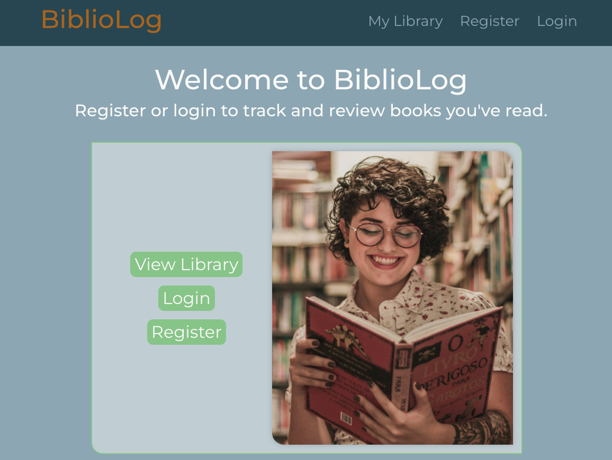

# BiblioLog - A Book Logging Web App

BiblioLog is a web application developed using React, Redux, SCSS, Express, Mongoose, and MongoDB. It allows users to create an account, build their library, rate books from 0 to 5, and write reviews. The integrated Google Books API simplifies book discovery and addition to your library.

[Visit BiblioLog Live](https://library-seven-mu.vercel.app/)

## Introduction

This project is the front-end of a project aimed at book enthusiasts. It provides users with a platform to create and manage their personal book libraries, complete with ratings and reviews. The seamless integration with the Google Books API makes book discovery a breeze. As part of our future plans, we're working on features such as the ability to modify ratings and reviews, automatic social media post generation, connecting with friends to explore their book collections, and finishing the mobile app version that was started with React Native.

## Technologies Used

- React
- Redux
- SCSS
- Express
- Mongoose
- MongoDB

I would greatly appreciate your feedback and suggestions if you decide to check it out!

Image of woman with glasses reading red book on home page is from https://www.pexels.com/photo/woman-reading-book-2167672/
